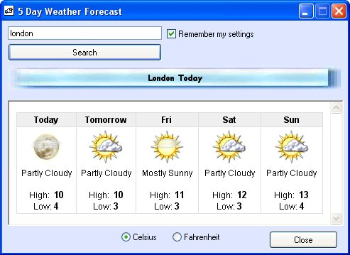



## Weather Forecast \(5 Day\)

### Description

"Weather" is an application which will query a weather server and display a 5 day forecast for the entered area. Cheap and cheerful!! :-)

Jim - www.jimbooth.co.uk
 
### More Info
 

             |
---                |---
**Submitted On**   |2003-03-10 16:46:22
**By**             |[Jim Booth](https://github.com/Planet-Source-Code/PSCIndex/blob/master/ByAuthor/jim-booth.md)
**Level**          |Intermediate
**User Rating**    |5.0 (10 globes from 2 users)
**Compatibility**  |VB 6\.0
**Category**       |[Complete Applications](https://github.com/Planet-Source-Code/PSCIndex/blob/master/ByCategory/complete-applications__1-27.md)
**World**          |[Visual Basic](https://github.com/Planet-Source-Code/PSCIndex/blob/master/ByWorld/visual-basic.md)
**Archive File**   |[Weather\_Fo1558343122003\.zip](https://github.com/Planet-Source-Code/jim-booth-weather-forecast-5-day__1-43959/archive/master.zip)

